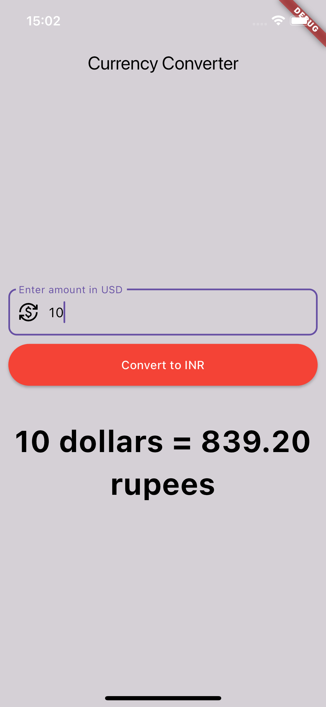

This is a practice reporsitory where I have tried implementing UI through flutter.

Implemented below two screens as part of learning.

a) Dollar to INR conversion page

b) Getting weather data from api and bind it to below UI :

